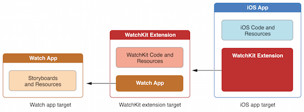
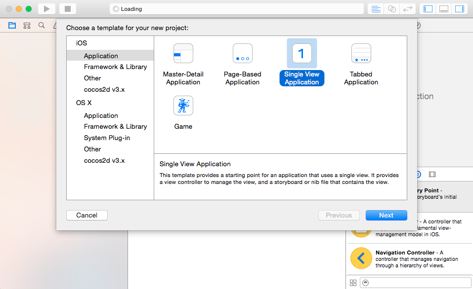

Watchkit was released finally.

This is the first part of a serial tutorial.
Please download Xcode 6.2 Beta with an Apple developer account.

Let's start the new journey.

Currently, you can't develop native app for iWatch.

As the diagram shows, there are three parts for a runnable watch app: containing iOS app, watchkit extension and watch app. They are all bundled in an iOS app.

### create new project

Let's start with a simple single view app with Xcode project because there is no content in the containing app.

### add the watch target

Then please add a watch target to the containing app. Xcode will generate related code and resource automatically.

 
